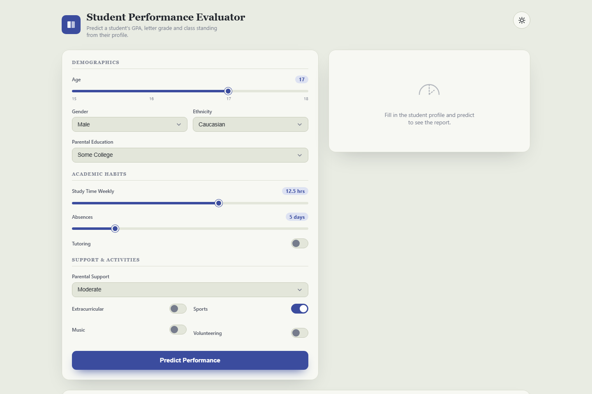

# 📚 Student Performance Evaluator


> A FastAPI web app that predicts a student's GPA and letter grade from real academic, demographic, and behavioral data — trained on a genuine Kaggle dataset, not synthetic samples.

## Screenshot



## Why This Exists

Most "student performance" demos run on toy or synthetic data with inflated accuracy. This project trains on the real **Kaggle Student Performance Data** dataset (2,392 actual student records) and reports honest, held-out test metrics — so the predictions reflect what a model can realistically learn from real-world academic and behavioral signals.

## Features

- **GPA prediction** via `RandomForestRegressor` (test R² = 0.93)
- **Letter grade classification (A–F)** via `RandomForestClassifier` (test accuracy = 0.69)
- **Percentile ranking** — shows where the predicted GPA falls relative to the full student cohort
- **Feature importance breakdown** — see which inputs (study time, absences, parental support, etc.) drive the prediction
- **Historical comparison** against the real GPA distribution of the dataset
- **12 real input features**: age, gender, ethnicity, parental education, weekly study time, absences, tutoring, parental support, extracurricular activities, sports, music, volunteering
- **"Academic ledger" themed UI** — indigo/gold color scheme, an SVG gauge for the predicted GPA, and full dark/light theme support
- **Zero external frontend dependencies** — vanilla JS and hand-rolled SVG, no CDN scripts

## Dataset & Model

| | |
|---|---|
| **Source** | [Kaggle — Student Performance Data](https://www.kaggle.com/datasets/muhammadazam121/student-performance-data) (`muhammadazam121/student-performance-data`) |
| **Records** | 2,392 real students |
| **Regression model** | `RandomForestRegressor` (200 estimators) → predicts continuous GPA (0.0–4.0) |
| **Classification model** | `RandomForestClassifier` (200 estimators) → predicts letter grade class (A–F) |
| **Test R² (GPA)** | **0.93** |
| **Test Accuracy (Grade)** | **0.69** |
| **Split** | 80/20 train/test, `random_state=42` |
| **Features used** | Age, Gender, Ethnicity, ParentalEducation, StudyTimeWeekly, Absences, Tutoring, ParentalSupport, Extracurricular, Sports, Music, Volunteering |

Models are trained in-process at server startup directly from `Student_performance_data.csv`, so the metrics above are recomputed every time the app boots.

## Tech Stack

| Layer | Tools |
|---|---|
| Backend | Python, FastAPI, Uvicorn |
| ML | scikit-learn (RandomForestRegressor, RandomForestClassifier) |
| Data | pandas, NumPy |
| Templating | Jinja2 |
| Frontend | Vanilla JS, hand-built SVG gauge — no external libraries or CDNs |
| Container | Docker |

## Project Structure

```
Student-Performance-Evaluation/
├── app/
│   ├── main.py                          # FastAPI app, model training & /predict endpoint
│   ├── requirements.txt
│   └── templates/
│       └── index.html                   # Academic ledger UI (form + result panel)
├── Student_performance_data.csv         # Real Kaggle dataset (2,392 records)
├── Student Performance Evaluation.ipynb # EDA & model exploration notebook
├── Dockerfile
└── screenshot.png
```

## Run Locally

**Prerequisites**: Python 3.11+

```bash
git clone https://github.com/ErdoganPeker/Student-Performance-Evaluation.git
cd Student-Performance-Evaluation/app

python -m venv .venv
.venv\Scripts\activate        # Windows
# source .venv/bin/activate   # macOS/Linux

pip install -r requirements.txt
python main.py
```

Open **http://localhost:5007** in your browser. Models train automatically on startup using the CSV in the repo root — no separate training step needed.

### Run with Docker

```bash
docker build -t student-performance-eval .
docker run -p 8000:8000 student-performance-eval
```

Open **http://localhost:8000**.

## API

`POST /predict` accepts a JSON body with the 12 student features and returns predicted GPA, letter grade, percentile, and feature importances. See `app/main.py` for the full request/response schema.

## License

MIT

## Developer

**Erdoğan Yasin Peker**
[GitHub](https://github.com/ErdoganPeker) · [LinkedIn](https://www.linkedin.com/in/erdogan-yasin-peker-b107ba24b/)
